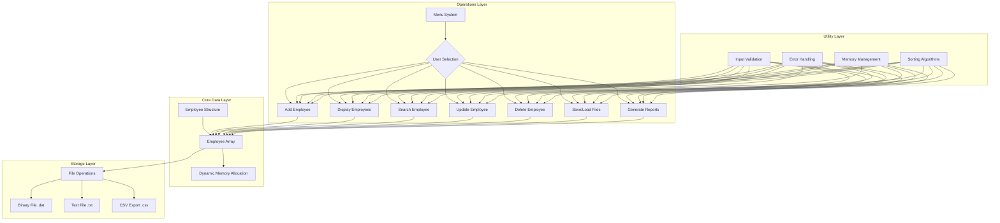
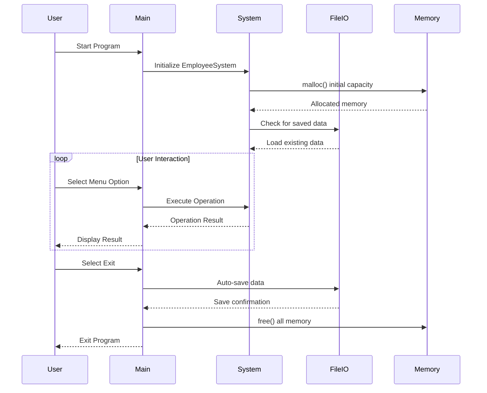

# Mini Employee Management System


[](https://en.cppreference.com/w/c/io)
[](https://en.cppreference.com/w/c/memory)
[](https://en.cppreference.com/w/c/language/pointer)

##  Table of Contents
- [Overview](#-overview)
- [Features](#-features)
- [System Architecture](#-system-architecture)
- [Data Structures](#-data-structures)
- [Installation](#-installation)
- [Compilation](#-compilation)
- [Usage](#-usage)
- [Code Flow](#-code-flow)
- [File Structure](#-file-structure)
- [API Documentation](#-api-documentation)
- [Memory Management](#-memory-management)
- [Testing](#-testing)
- [Extending the System](#-extending-the-system)
- [Troubleshooting](#-troubleshooting)
- [License](#-license)

##  Overview

A comprehensive console-based Employee Management System written in pure C that demonstrates fundamental and advanced C programming concepts. This system provides a complete CRUD (Create, Read, Update, Delete) interface for managing employee records with persistent storage.

##  Features

###  **Core Operations**
- **Add Employees** with detailed information
- **Display All Employees** in formatted tables
- **Search Employees** by ID with exact/partial matching
- **Update Employee** information
- **Delete Employees** from the system
- **Save/Load Data** to/from binary/text files
- **Export Data** to CSV format for external use

###  **Advanced Features**
- **Dynamic Memory Management** using `malloc`/`free`
- **Function Pointers** for menu operations
- **Error Handling** with comprehensive error messages
- **Input Validation** for all user inputs
- **Sorting Capabilities** by various fields
- **Statistics Generation** (counts, averages, etc.)

###  **Data Safety**
- **Auto-save** on exit
- **Backup Creation** before major operations
- **Data Integrity** checks
- **Memory Leak Prevention** with proper cleanup

##  System Architecture



##  Data Structures

### Employee Structure
```c
typedef enum {
    JUNIOR,
    MID_LEVEL,
    SENIOR,
    LEAD,
    MANAGER
} EmployeeLevel;

typedef enum {
    ACTIVE,
    ON_LEAVE,
    TERMINATED,
    RESIGNED
} EmployeeStatus;

typedef struct {
    int id;                    // Unique identifier
    char name[MAX_NAME_LEN];   // Employee name
    char department[MAX_DEPT_LEN]; // Department
    float salary;              // Monthly salary
    EmployeeLevel level;       // Job level
    EmployeeStatus status;     // Employment status
    char email[MAX_EMAIL_LEN]; // Email address
    char phone[MAX_PHONE_LEN]; // Phone number
    time_t join_date;          // Joining date
} Employee;
```

### System Structure
```c
typedef struct {
    Employee *employees;       // Dynamic array of employees
    int count;                 // Current number of employees
    int capacity;              // Current array capacity
    char filename[256];        // Current data file name
} EmployeeSystem;
```

##  Installation

### Prerequisites


- **GCC Compiler** (version 4.9 or higher)
- **Make** (optional, for build automation)
- **Git** (for cloning repository)

### Quick Installation
```bash
# Clone the repository
git clone https://github.com/yourusername/employee-management-system.git
cd employee-management-system

# Compile the program
gcc -o employee_system employee_system.c

# Run the program
./employee_system
```

### Advanced Installation
```bash
# Compile with all warnings enabled
gcc -Wall -Wextra -Werror -pedantic -o employee_system employee_system.c

# Compile with debug symbols
gcc -g -o employee_system employee_system.c

# Compile with optimization
gcc -O2 -o employee_system employee_system.c
```

##  Compilation

### Basic Compilation
```bash
gcc employee_system.c -o employee_system
```

### Compilation with Different Standards
```bash
# C99 Standard
gcc -std=c99 employee_system.c -o employee_system

# C11 Standard
gcc -std=c11 employee_system.c -o employee_system

# C17 Standard
gcc -std=c17 employee_system.c -o employee_system
```

### Using Makefile
```bash
# If Makefile is provided
make                # Build the program
make debug          # Build with debug symbols
make release        # Build with optimizations
make clean          # Clean build files
make test           # Run tests
```

##  Usage

### Starting the Program
```bash
./employee_system
```

### Command Line Arguments
```bash
# Load specific data file
./employee_system --file employees.dat

# Start with specific capacity
./employee_system --capacity 100

# Run in silent mode (no welcome banner)
./employee_system --silent

# Display help
./employee_system --help
```

### Interactive Menu
```
╔══════════════════════════════════════╗
║   EMPLOYEE MANAGEMENT SYSTEM v1.0    ║
╠══════════════════════════════════════╣
║  1. Add New Employee                 ║
║  2. Display All Employees            ║
║  3. Search Employee by ID            ║
║  4. Update Employee Information      ║
║  5. Delete Employee                  ║
║  6. Save Data to File                ║
║  7. Load Data from File              ║
║  8. Export to CSV                    ║
║  9. Generate Report                  ║
║ 10. System Statistics                ║
║  0. Exit                             ║
╚══════════════════════════════════════╝
Enter your choice: 
```

##  Code Flow

### Main Program Flow


### Add Employee Flow
```
1. User selects "Add Employee"
2. System validates current capacity
   └── If full, realloc() more memory
3. Prompt for employee details:
   ├── Auto-generate ID
   ├── Enter name (validation)
   ├── Enter department
   ├── Enter salary (min/max check)
   ├── Select level from enum
   ├── Set status (default: ACTIVE)
   ├── Enter email (format validation)
   └── Enter phone (format validation)
4. Create Employee structure
5. Add to dynamic array
6. Increment count
7. Display success message
```

### Search Employee Flow
```
1. User selects "Search Employee"
2. Choose search type:
   ├── By ID (exact match)
   ├── By Name (partial match)
   └── By Department (partial match)
3. Enter search term
4. Linear search through array
5. If found:
   └── Display formatted employee info
6. If not found:
   └── Display "Employee not found"
7. Return to main menu
```

### Simplified Single File Version
For the mini system, everything is in `employee_system.c`:
```c
// employee_system.c structure:
// 1. Include headers
// 2. Define constants and macros
// 3. Define enums and structs
// 4. Global variables (if any)
// 5. Function prototypes
// 6. Function implementations
// 7. Main function
```

##  API Documentation

### Core Functions

#### System Initialization
```c
/**
 * Initialize the employee system
 * @param system Pointer to EmployeeSystem structure
 * @param initial_capacity Initial capacity for employee array
 * @return 0 on success, -1 on failure
 */
int init_system(EmployeeSystem *system, int initial_capacity);
```

#### Employee Management
```c
/**
 * Add a new employee to the system
 * @param system Pointer to EmployeeSystem
 * @param emp Employee data to add
 * @return Employee ID on success, -1 on failure
 */
int add_employee(EmployeeSystem *system, const Employee *emp);

/**
 * Find employee by ID
 * @param system Pointer to EmployeeSystem
 * @param id Employee ID to search for
 * @return Pointer to employee if found, NULL otherwise
 */
Employee* find_employee(EmployeeSystem *system, int id);

/**
 * Delete employee by ID
 * @param system Pointer to EmployeeSystem
 * @param id Employee ID to delete
 * @return 0 on success, -1 on failure
 */
int delete_employee(EmployeeSystem *system, int id);
```

#### File Operations
```c
/**
 * Save employee data to file
 * @param system Pointer to EmployeeSystem
 * @param filename Name of file to save to
 * @return Number of employees saved, -1 on error
 */
int save_to_file(EmployeeSystem *system, const char *filename);

/**
 * Load employee data from file
 * @param system Pointer to EmployeeSystem
 * @param filename Name of file to load from
 * @return Number of employees loaded, -1 on error
 */
int load_from_file(EmployeeSystem *system, const char *filename);
```

### Function Pointers Example
```c
// Define function pointer type for menu operations
typedef void (*MenuFunction)(EmployeeSystem*);

// Array of function pointers for menu operations
MenuFunction menu_functions[] = {
    add_employee_menu,
    display_employees_menu,
    search_employee_menu,
    update_employee_menu,
    delete_employee_menu,
    save_data_menu,
    load_data_menu
};

// Usage in menu system
void execute_menu_option(EmployeeSystem *system, int choice) {
    if (choice >= 1 && choice <= 7) {
        menu_functions[choice - 1](system);
    }
}
```

##  Memory Management

### Dynamic Array Implementation
```c
// Initial allocation
system->employees = (Employee*)malloc(initial_capacity * sizeof(Employee));
if (!system->employees) {
    fprintf(stderr, "Memory allocation failed!\n");
    return -1;
}

// Reallocation when full
if (system->count >= system->capacity) {
    int new_capacity = system->capacity * 2;
    Employee *temp = (Employee*)realloc(system->employees, 
                                       new_capacity * sizeof(Employee));
    if (!temp) {
        fprintf(stderr, "Memory reallocation failed!\n");
        return -1;
    }
    system->employees = temp;
    system->capacity = new_capacity;
}

// Proper cleanup
void cleanup_system(EmployeeSystem *system) {
    if (system->employees) {
        free(system->employees);
        system->employees = NULL;
    }
    system->count = 0;
    system->capacity = 0;
}
```

### Memory Usage Pattern
```
┌─────────────────────────────────────────┐
│        Memory Layout Example            │
├─────────────────────────────────────────┤
│ System starts with capacity: 10        │
│ Each Employee: ~256 bytes              │
│ Initial memory: 10 * 256 = 2.5 KB      │
│                                         │
│ When adding 11th employee:             │
│ 1. Check count >= capacity             │
│ 2. Double capacity: 10 → 20            │
│ 3. realloc() to 20 * 256 = 5 KB        │
│ 4. Add new employee                    │
└─────────────────────────────────────────┘
```

##  Testing

### Unit Testing
```bash
# Compile with test suite
gcc -o test_system employee_system.c test_main.c
./test_system
```

### Test Cases
```c
// Sample test function
void test_add_employee() {
    EmployeeSystem system;
    init_system(&system, 5);
    
    Employee emp = {
        .id = 1,
        .name = "John Doe",
        .department = "Engineering",
        .salary = 50000.0,
        .level = SENIOR,
        .status = ACTIVE
    };
    
    int result = add_employee(&system, &emp);
    assert(result == 1); // ID should be 1
    assert(system.count == 1);
    
    cleanup_system(&system);
    printf("✓ test_add_employee passed\n");
}
```

### Manual Testing Commands
```bash
# Test adding employees
echo -e "1\nJohn Doe\nEngineering\n50000\n2\n1\njohn@company.com\n1234567890\n" | ./employee_system

# Test searching
echo -e "3\n1\n" | ./employee_system

# Test file operations
echo -e "6\ntest.dat\n7\ntest.dat\n" | ./employee_system
```

##  Extending the System

### Adding New Features

#### 1. Sorting Functionality
```c
// Function pointer for comparison
typedef int (*CompareFunc)(const Employee*, const Employee*);

// Comparison functions
int compare_by_salary(const Employee *a, const Employee *b) {
    if (a->salary < b->salary) return -1;
    if (a->salary > b->salary) return 1;
    return 0;
}

int compare_by_name(const Employee *a, const Employee *b) {
    return strcmp(a->name, b->name);
}

// Generic sort function
void sort_employees(EmployeeSystem *system, CompareFunc compare) {
    qsort(system->employees, system->count, sizeof(Employee), 
          (int (*)(const void*, const void*))compare);
}
```

#### 2. Advanced Search
```c
// Search by multiple criteria
typedef struct {
    int id;
    char name[MAX_NAME_LEN];
    char department[MAX_DEPT_LEN];
    float min_salary;
    float max_salary;
} SearchCriteria;

Employee** search_employees(EmployeeSystem *system, SearchCriteria *criteria, int *result_count) {
    // Implement multi-criteria search
    // Return array of matching employees
}
```

#### 3. Report Generation
```c
void generate_report(EmployeeSystem *system, const char *report_type) {
    if (strcmp(report_type, "department") == 0) {
        generate_department_report(system);
    } else if (strcmp(report_type, "salary") == 0) {
        generate_salary_report(system);
    } else if (strcmp(report_type, "status") == 0) {
        generate_status_report(system);
    }
}
```

##  Troubleshooting

### Common Compilation Errors

**1. Undefined Reference Errors**
```bash
# Error: undefined reference to `some_function'
# Solution: Ensure all function implementations are present
# Check function names match prototypes exactly
```

**2. Memory Allocation Errors**
```bash
# Error: malloc: corrupted top size
# Solution: Check for buffer overflows
# Use valgrind for memory debugging
valgrind ./employee_system
```

**3. File Permission Errors**
```bash
# Error: Cannot open file for writing
# Solution: Check file permissions
chmod +w employees.dat
# Or run with appropriate permissions
```

### Debugging Tips
```bash
# Compile with debug symbols
gcc -g -o employee_system employee_system.c

# Run with gdb
gdb ./employee_system

# Common gdb commands:
# break main           # Set breakpoint at main
# run                 # Start program
# next                # Execute next line
# print variable      # Print variable value
# backtrace           # Show call stack
```

### Valgrind Memory Check
```bash
# Install valgrind
sudo apt install valgrind  # Ubuntu/Debian

# Run memory check
valgrind --leak-check=full ./employee_system

# Expected output: "All heap blocks were freed -- no leaks are possible"
```

##  Contributing


Contributions are welcome! Please feel free to submit a Pull Request.

### Contribution Guidelines
1. Fork the repository
2. Create your feature branch (`git checkout -b feature/AmazingFeature`)
3. Commit your changes (`git commit -m 'Add some AmazingFeature'`)
4. Push to the branch (`git push origin feature/AmazingFeature`)
5. Open a Pull Request

### Code Style
- Follow the existing code formatting
- Add comments for new functions
- Include error handling
- Test your changes thoroughly

##  Learning Resources

### C Programming Concepts Covered
1. **Variables & Data Types**: int, float, char, arrays, strings
2. **Functions**: Parameters, return values, prototypes
3. **Structures**: Employee struct, nested structures
4. **Pointers**: Pointer arithmetic, function pointers
5. **Dynamic Memory**: malloc, calloc, realloc, free
6. **File Handling**: fopen, fread, fwrite, fclose
7. **Control Flow**: if-else, switch, loops
8. **Advanced Topics**: enums, typedef, unions (optional)

### Further Reading
- [The C Programming Language (K&R)](https://en.wikipedia.org/wiki/The_C_Programming_Language)
- [C Programming FAQs](http://c-faq.com/)
- [GCC Documentation](https://gcc.gnu.org/onlinedocs/)
- [C Reference on cppreference](https://en.cppreference.com/w/c)

---

**Happy Coding!** 💻

*This project demonstrates professional C programming practices suitable for educational purposes and real-world applications.*
